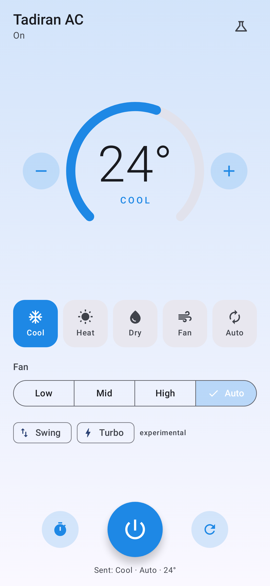
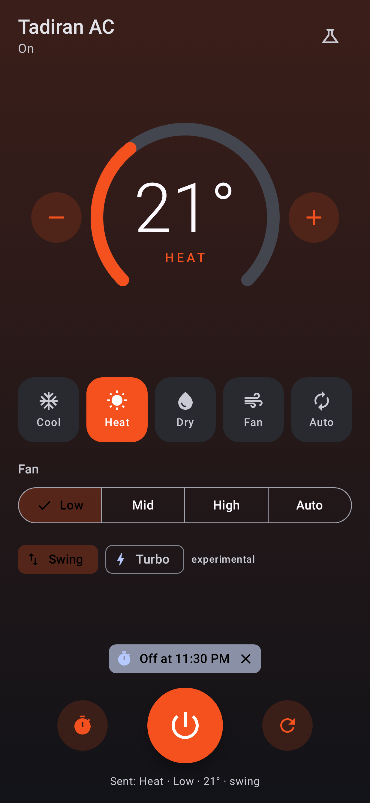
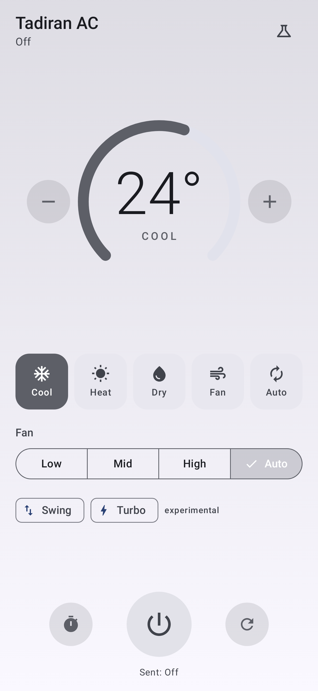

# Tadiran Remote

A simple Android remote for **Tadiran** air conditioners (TAC 297 remote), for phones with a
built-in IR blaster.

<p>
  
  
  
</p>

An AC remote sends its whole state (power, mode, fan speed and temperature) in every
button press. The app does the same. It keeps track of the state you've chosen, and each
change sends a message describing it. Several quick +/− taps send only the temperature you
end on.

- **Power** sends Off, or the current state when turning on. **Resend** (↻, or long-press on
  power) sends the current state again, for example after someone used the original remote.
- **Modes:** Cool, Heat, Dry, Fan, Auto. Temperatures 16–30 °C. Fan speeds Low, Mid, High,
  Auto. In Dry mode the fan selector is disabled, and Fan mode has no Auto speed, because
  the real remote behaves that way.
- **Swing** and **Turbo** are *experimental*. Their bits come from other Tadiran and Amcor
  projects, and haven't been confirmed on a TAC 297 unit.
- **Timer:** turn the AC off or on in 15 minutes to 8 hours. The *phone* sends the code at
  that time, so leave it facing the AC. It uses an alarm-clock alarm (the alarm icon shows
  in the status bar), and it is re-scheduled after a reboot. On Xiaomi phones, allow
  Autostart and set Battery saver to "No restrictions" for the app.
- **Lab** (flask icon) helps find the AC's own timer. It sends the current state with
  chosen bits flipped in the bytes nobody has decoded, so you can watch how the AC reacts.

## Install

Download the APK from the [latest release](../../releases/latest) on the phone and open it.
You'll need to allow installing apps from your browser.

## Protocol

The app builds each IR message itself instead of replaying recordings. The format is
IRremoteESP8266's
[Amcor](https://github.com/crankyoldgit/IRremoteESP8266/blob/master/src/ir_Amcor.h)
protocol: 8 bytes sent LSB-first, where a long mark is a 1. The full layout is in
[`TadiranProtocol.kt`](app/src/main/java/zone/amit/tadiranremote/TadiranProtocol.kt).
Bytes 3–4 are always zero in every known capture, and are probably the timer.

The unit tests check the encoder against SmartIR's recordings of the real remote
(`app/src/test/resources/smartir_1345.ir`, from
[tadiran-irdb](https://github.com/anadav/tadiran-irdb)). 295 of the 301 match byte for byte.
The other 6 are broken in SmartIR and are fixed by encoding:

- Cool/Auto/17, Auto/Auto/20 and Fan/Mid/23 are bit-shifted, so the checksum is wrong.
- Cool/High/17 and 18 are swapped, and Cool/High/28 sends 29°.

## Building

You need JDK 21 and an Android SDK with `platforms;android-37.2`.

```sh
./gradlew testDebugUnitTest assembleDebug          # unit tests + debug APK
adb install -r app/build/outputs/apk/debug/app-debug.apk
./gradlew recordRoborazziDebug                     # re-render screenshots/
```

Pushing a `v*` tag makes CI build a signed release APK and attach it to a GitHub release.
Signing uses the `SIGNING_*` repository secrets. Local release builds read the same
variables from the environment.

## License

MIT. See [LICENSE](LICENSE).
